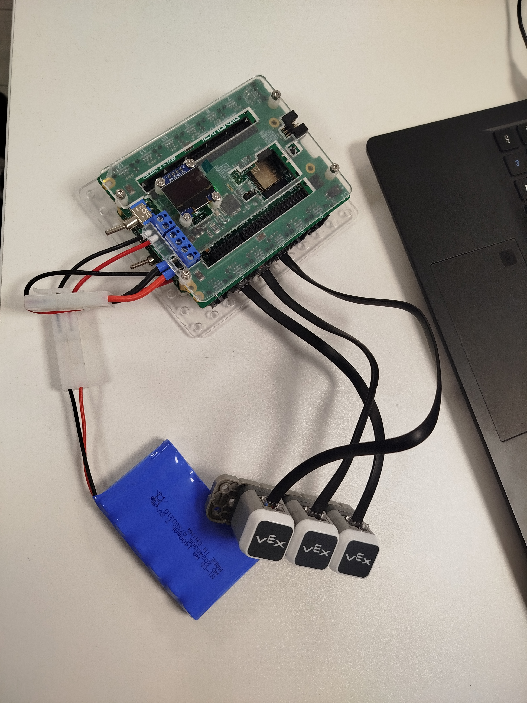

Вот обновленный README с указанием совместимости контроллера:

# 🚀 Simon Says на VEX IQ: Игра на Скорость и Память 🌟

  
*Классическая игра с использованием контроллера Examen-Technolab, совместимого с VEX IQ!*

---

## 📸 Физическая сборка  
 
*Компоненты системы:*  
1. **Центральный контроллер**:  
   - Examen-Technolab VEX IQ совместимый микроконтроллер  
   - Полная совместимость с экосистемой VEX IQ  
   - Поддержка всех стандартов VEX Robotics  

2. **Интерфейсные модули**:  
   - 3× Сенсорные LED-кнопки VEX IQ (порты 2, 3, 4)  

3. **Питание**:  
   - Аккумуляторная батарея 7.4V Li-Po (встроенная в контроллер)  

---

## 🎮 О проекте  
**Simon Says** — это ультра-динамичная игра, которая бросит вызов вашей памяти и реакции!  
Используя **совместимый контроллер Examen-Technolab** и сенсорные LED-модули VEX IQ, проект создает:  
- 💥 Яркие световые эффекты с частотой обновления 10 мс  
- 🔋 Энергоэффективную работу за счет оптимизации кода  
- 🔄 Полную интеграцию с образовательными стандартами VEX Robotics  

---

## 🛠️ Технические характеристики  
| Компонент          | Параметры                                |  
|--------------------|------------------------------------------|  
| **Контроллер**     | Examen-Technolab VEX IQ совместимый     |  
| Макс. длина цепочки| 50 шагов                                 |  
| Задержка отклика  | 10 мс (ультра-низкая)                    |  
| Поддержка портов   | 12 портов (используются 2, 3, 4)        |  
| Совместимость     | Полная с VEX IQ Brain и компонентами    |  

---

## 📚 Инструкция по запуску  
1. **Подключение**:  
   - Используйте **совместимый контроллер Examen-Technolab**  
   - Подключите TouchLED к портам 2, 3, 4 стандартными кабелями VEX IQ  

2. **Программирование**:  
   - Откройте код в **VEXcode IQ** или **Arduino IDE**  
   - Выберите устройство: **Examen-Technolab VEX IQ Controller**  

3. **Запуск**:  
   - Нажмите кнопку питания на контроллере  
   - Следуйте световым подсказкам на модулях  

---

## 🏆 Преимущества платформы  
- **Examen-Technolab Controller**:  
  - 100% совместимость с VEX IQ экосистемой  
  - Расширенные функции программирования через VEXcode  
  - Поддержка всех официальных соревнований VEX Robotics  

- **Образовательный потенциал**:  
  - Идеально для изучения:  
    - Алгоритмической логики  
    - Обработки сенсорных событий  
    - Управления светодиодными интерфейсами  

---

🔥 **Совместимость и производительность в одном решении!** 🔥  
*Создано для образовательных проектов Examen-Technolab. Автор: Мартиросян Никита Артурович*  

IT-Cube г. Минеральные Воды
